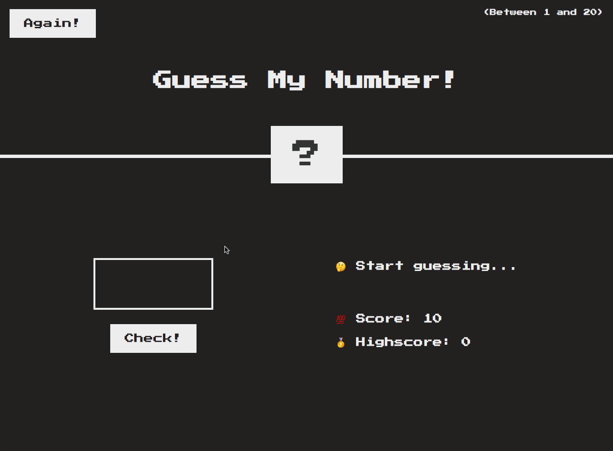
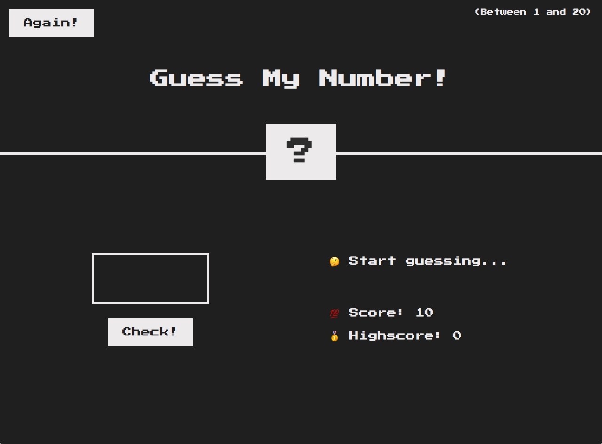
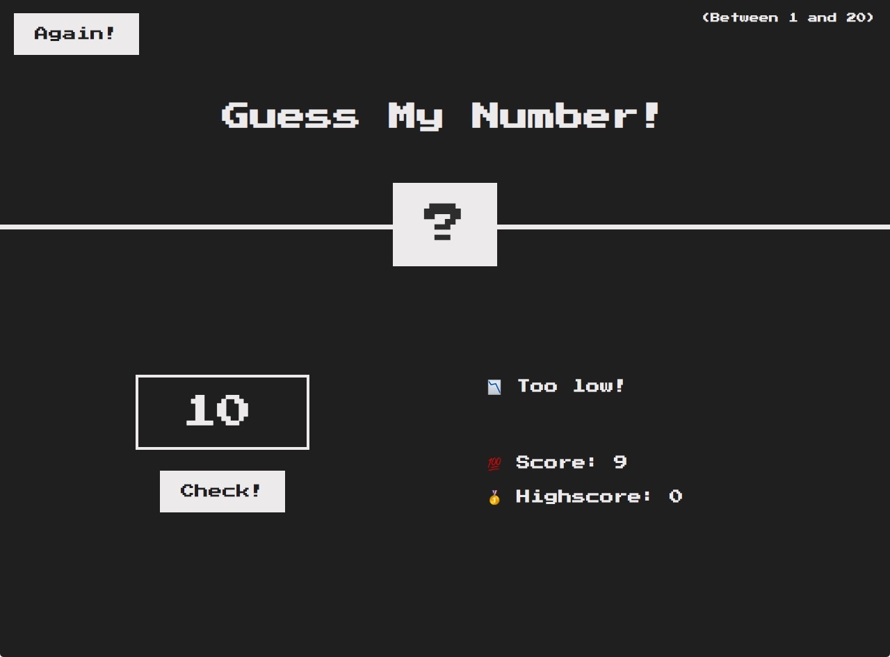
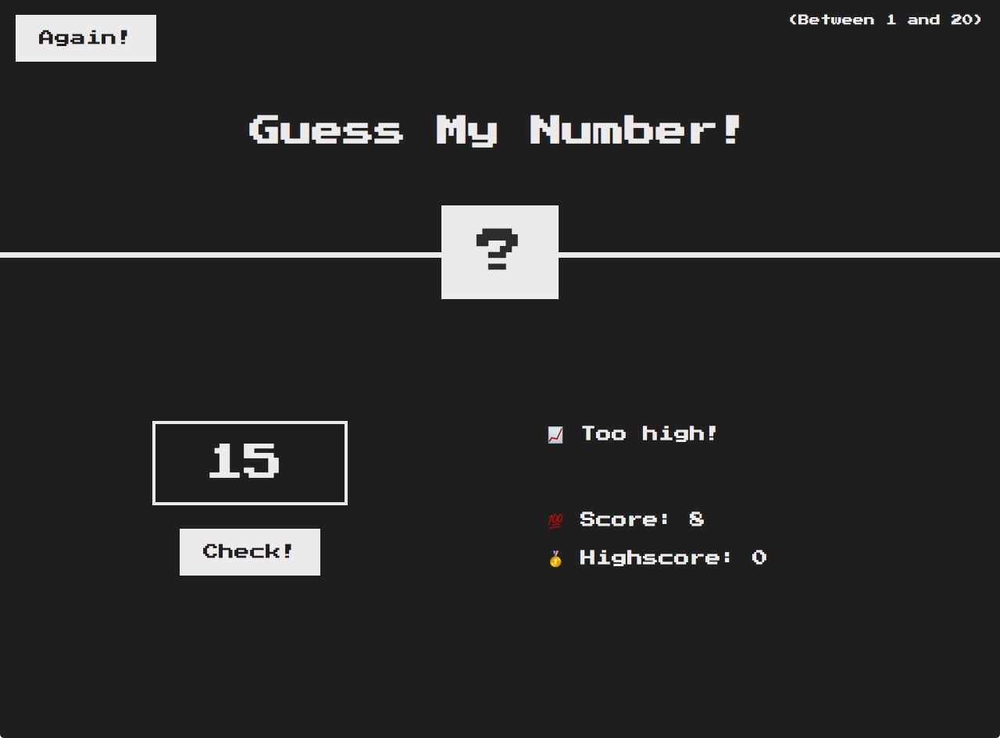
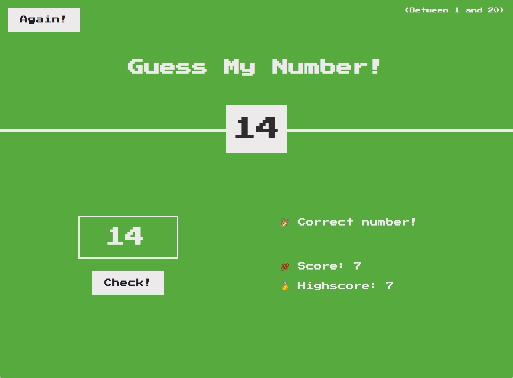
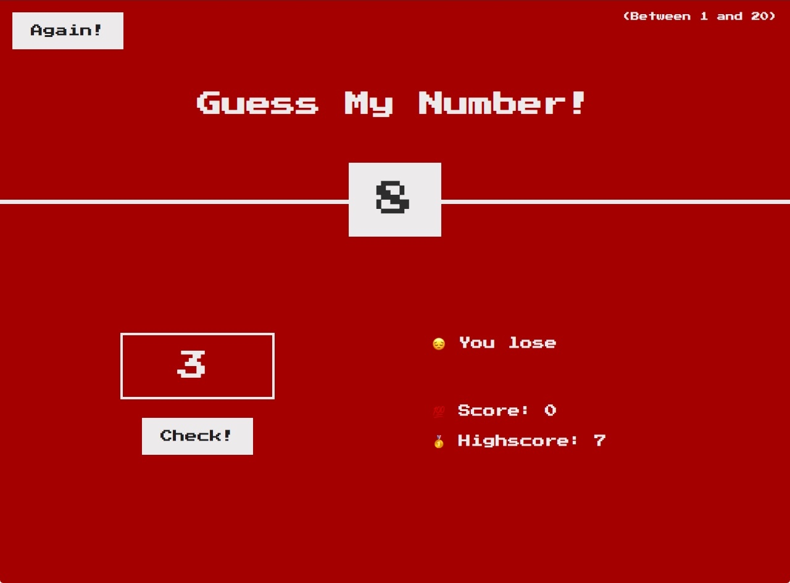

# Guess-My-Number

**Guess-My-Number** is a simple guessing game played in the web browser where the goal is to try and guess a number between 1 and 20.
This game was built as a playful exercise in DOM manipulation using a combination of **HTML**/**CSS**/**JS**.

[Give it a try!](https://bryandevelops.github.io/Guess-My-Number/)

## Rules ##
* Enter a number value between 1 and 20 into the box by clicking the top or bottom arrows inside the input, or by typing it out with your keyboard. 
* Afterwards, either click `Check!` or hit your Enter key to submit a guess. If the guess is too low or too high, the interface will change to reflect that to the user. 
* If the guess is correct, the background will turn green alerting the user of their win, and the users highscore will now reflect their score. 
* The user begins with a score of 10 each game and every time a failed guess is made, 1 is deducted from the users total score, making 10 the highest possible score. 
* To play again, click the `Again!` button at the top of the page to reset the game while still keeping track of the users highscore. If the user tries again and wins with a lower score, high score will not update, however, if they try again and win with a higher score, their highscore *will* update.

## Demo ##
Here is a quick demonstration of the game in action. (Only 2 tries 😅)

## Images ##

1. ###### Game Start ######

2. ###### Guess Too Low ######

3. ###### Guess Too High ######

4. ###### Game Win ######

5. ###### Game Lose ######

## Enjoy! ##
[Give it a try!](https://bryandevelops.github.io/Guess-My-Number/)
